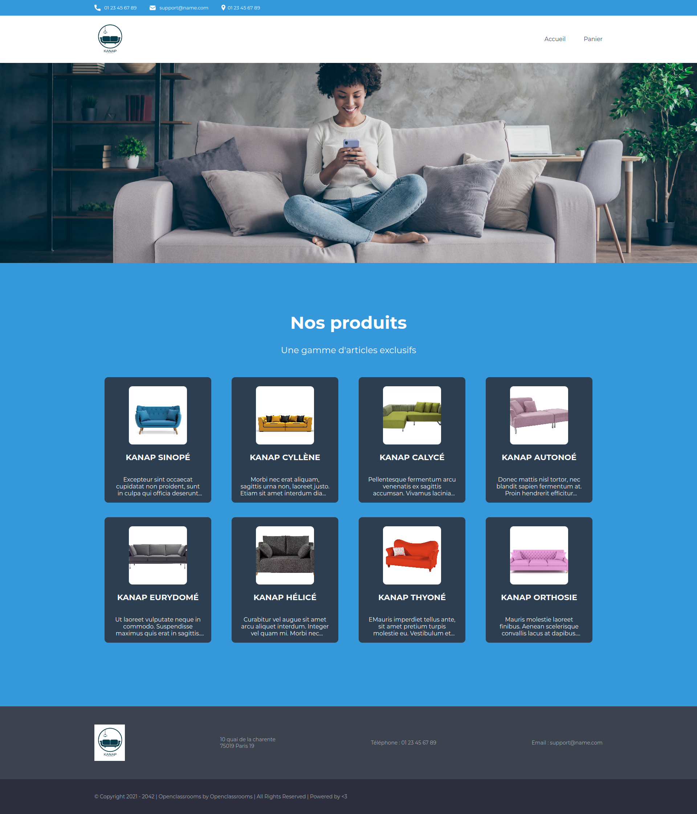

# Kanap 🛋 : Site e-commerce en JavaScript 

> 🖥️ **Développer une nouvelle plateforme de e-commerce pour la vente en ligne des canapés de la société Kanap !**

## 🎯 La mission :

_Implémenter le nouveau site e-commerce de manière dynamique avec Javascript et rédiger le plan de tests unitaires de l'application._

## ⚛️ Les technologies :

## 🏆 Les compétences :

- **Interagir avec un web service avec JavaScript**
- **Gérer des événements JavaScript**
- **Valider des données issues de sources externes**
- **Créer un plan de test pour une application**

## 🧞 Commandes

Toutes les commandes sont exécutées depuis la racine du projet, à partir d'un terminal :

| Command                   | Action                                           |
| :------------------------ | :----------------------------------------------- |
| `npm install`             | Installe les dépendances                         |
| `node server`             | Démarre le serveur local sur `localhost:3000`    |

